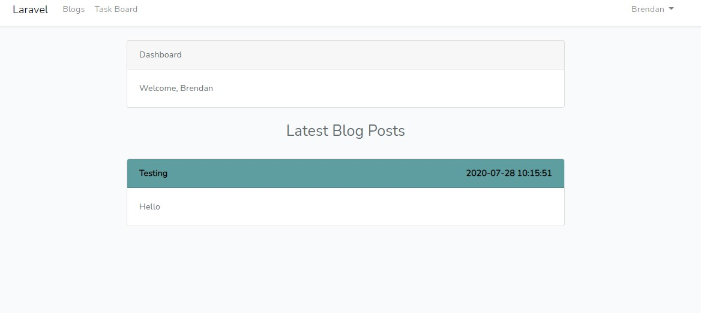

# laravel website hosted on heroku
## Features:
### Created a blog page where blogs can be added updated and deleted 

### Users can register and login 
* when a user logs in they can see a dashboard with a feed of the latest blog posts 

* users also have access to a Trello style task board where they can create tasks and move them through from ToDo -> In Progress-> Done

